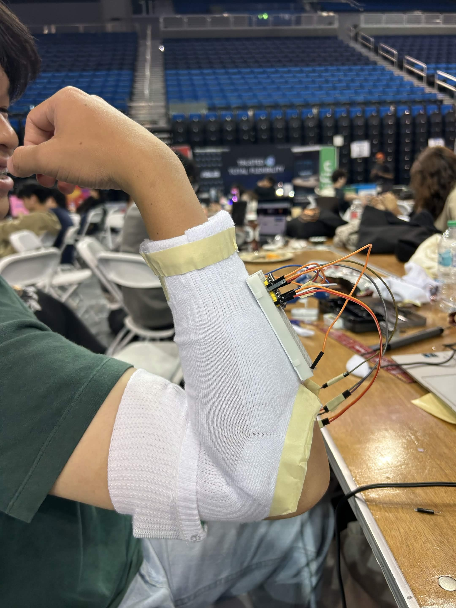
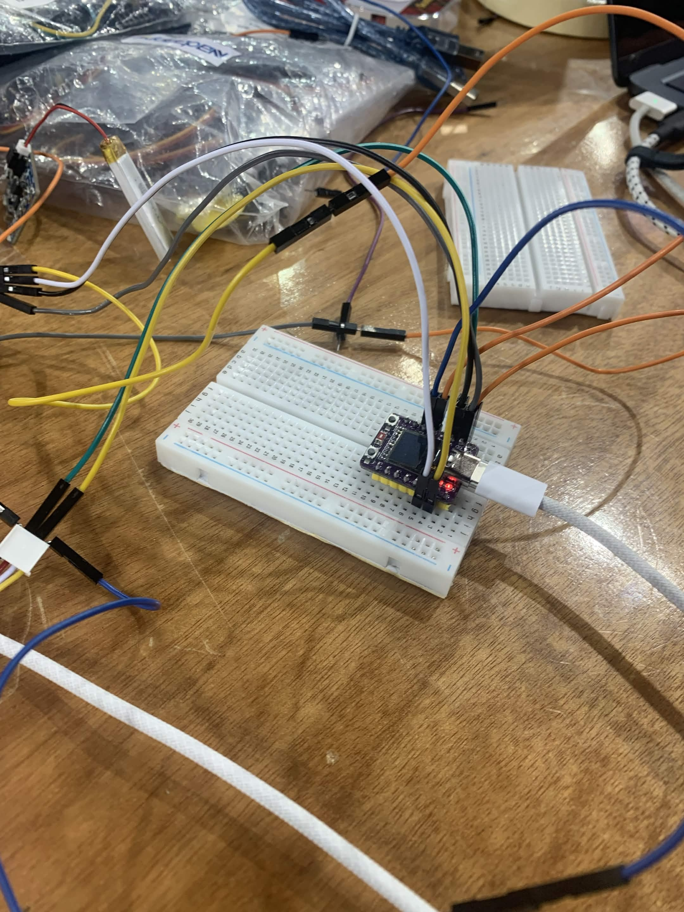
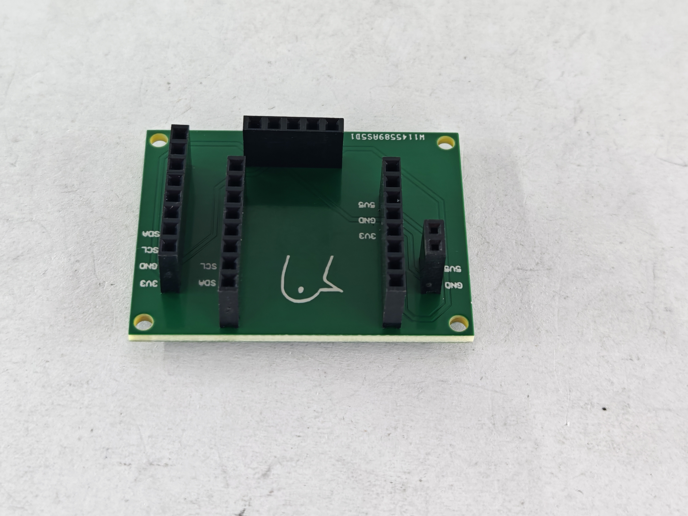
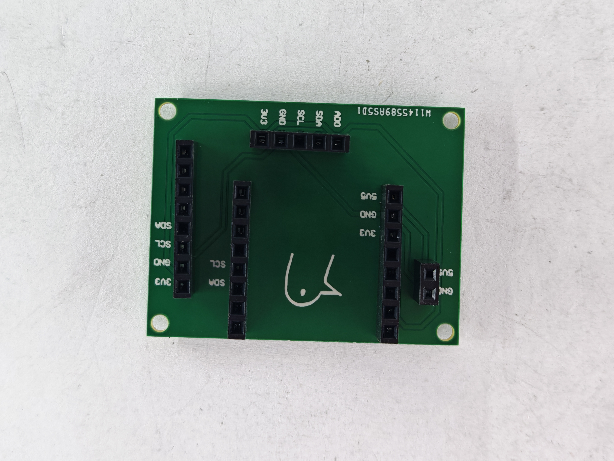
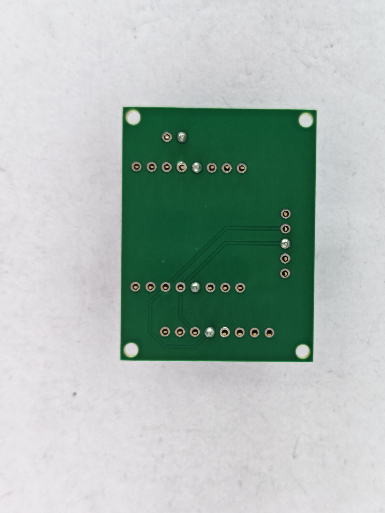
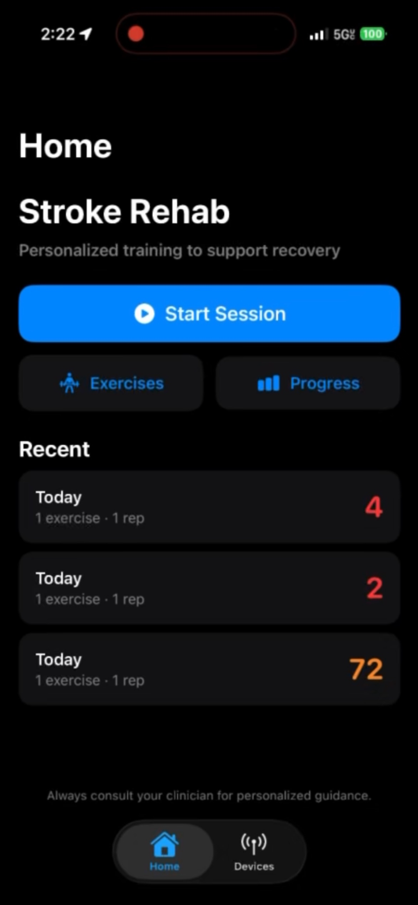

# Physio

An arm-worn prototype for exploring stroke rehabilitation feedback, built with an ESP32-C3, two motion sensors, and an iOS app.

We built the first version at LA Hacks 2026 in 36 hours. Sensors on the bicep and wrist send movement data to the phone over Bluetooth. The app lets you choose exercises, records movement, and runs a small neural network on the phone to produce a score.

<p align="center">
  
</p>

*The hackathon prototype, with sensors on the bicep and wrist.*

**[Watch the hardware demo (Esp32.mp4)](https://github.com/majockbim/physio/releases/tag/v0.1.0#demo-spin)** · [Devpost build story](https://devpost.com/software/strokr-ai) · [Original hackathon release](https://github.com/majockbim/physio/releases/tag/v0.1.0)

The breadboard sits on the bicep and takes up a lot of space. After the hackathon, I (Majock) designed a two-layer carrier PCB in Altium to reduce the jumper wiring and make the assembly more compact. PCBWay reached out after seeing the project and sponsored the next hardware iteration.

**Current status:** the original prototype is demonstrated above. PCBWay has sent factory photos of the custom boards; they have not arrived yet, so I have not tested the PCB assembly. Physio is a development prototype, and its score has not been validated as a clinical measure.

## From breadboard to PCB

The first version was quick to wire up, but the breadboard was bulky on the arm. I wanted to keep the same basic sensor setup while replacing some of the jumper wiring with PCB traces and giving the modules a smaller base to sit on.

<table>
  <tr>
    <td align="center"></td>
    <td align="center"></td>
  </tr>
  <tr>
    <td align="center">Breadboard power-on testing at the hackathon</td>
    <td align="center">Custom carrier board, photographed at PCBWay</td>
  </tr>
</table>

### The V2 carrier board

I designed the board in **Altium Designer**. It has two copper layers, socket headers for the module connections, routed power and I²C signals, and four mounting holes. The ESP32 and sensor electronics remain on separate modules; the carrier provides their interconnections.

| Part of the design | What is in this revision |
| --- | --- |
| Connections | Three 1×8 headers (`P1`–`P3`), one 1×5 header (`P4`), and one 1×2 header (`P5`), all at 2.54 mm pitch |
| Routing | Shared power, ground, SDA, and SCL connections; the five-pin sensor connection includes the address-select connection |
| Assembly | Through-hole socket headers, visible in the factory photos |
| Mechanical layout | Four corner mounting holes and silkscreen labels for the connections |
| Bring-up | Pending delivery; fit, power, sensor communication, and BLE streaming still need checking on the assembled board |

The carrier does not include an onboard battery-charging circuit. The goal for this revision is reducing wiring and bulk; the photos show the carrier before the modules are fitted.

[Hardware notes and design files](hardware/README.md) · [Altium project](hardware/altium/physio.PrjPcb) · [Gerbers and drill files](hardware/manufacturing/physio_gerbers.zip) · [BOM](hardware/manufacturing/physio_BOM.xlsx) · [Pick-and-place export](hardware/manufacturing/physio_pick_place.csv)

### Supported by PCBWay

**PCB fabrication and assembly for this iteration were sponsored by [PCBWay](https://www.pcbway.com/).** They contacted me after seeing the project and offered to support the next hardware version. That gave me the opportunity to take the breadboard design through PCB layout and manufacturing.

<p align="center">
  
  
</p>

*Photos supplied by PCBWay before delivery. The boards have not arrived yet, so assembly inspection and electrical testing on my side are still ahead.*

## How it works

```text
Bicep + wrist IMUs → ESP32-C3 → Bluetooth LE → iOS app → on-device score
```

### Sensing and Bluetooth

The two MPU6050 modules share an I²C bus. They use different addresses (`0x68` and `0x69`) so the ESP32 can read both. An SSD1306 OLED gives us a simple way to check the hardware while debugging.

The firmware packs a timestamp, accelerometer and gyroscope readings, and estimated pitch/roll/yaw for both sensors into a **76-byte BLE notification**. The prototype targets roughly **80 updates per second**; the current loop uses a 12 ms interval, so actual throughput depends on sensor reads, serial logging, and the BLE connection.

The [firmware](embedded/src/main.cpp) and [packet definition](embedded/include/bluetooth/ble_manager.hpp) are small enough to follow directly. The app decodes the same layout in [BLEManager.swift](app/Stroke%20Rehab/BLEManager.swift).

### The app

<p align="center">
  
</p>

The Swift app connects through CoreBluetooth, shows live sensor data, lets you select exercises, and saves session results. Exercise recordings are passed to the model for scoring. There is also a developer view for inspecting the incoming data and running inference.

Inference runs on the phone through **Zetic MLange**. The app loads the configured model through the Zetic SDK, which can require a download. Optional spoken feedback uses **ElevenLabs over the network**, sending the text to be spoken. Local inference and network-based speech are separate parts of the app.

### What the score means

The model is a PyTorch 1D CNN trained using the [JU-IMU dataset](https://github.com/youngminoh7/JU-IMU). It classifies recordings into the dataset's stroke and healthy classes. The app displays `Int(P(healthy) × 100)` as the prototype's score; it is not a percentage of recovery or a validated assessment of exercise form.

For each recording, the app takes 12 accelerometer/gyroscope channels, applies the saved per-channel training mean and standard deviation, and interpolates to 128 timesteps. Three convolution blocks feed a two-class output. Training uses side-aware sensor selection to choose the affected limb; live inference expects wrist channels followed by bicep channels.

The main implementation details are in [the CNN](model/src/cnn.py), [training data preparation](model/src/data_loader.py), and [the Swift inference pipeline](app/Stroke%20Rehab/MovementQualityInference.swift).

## References

- Oh et al. (2024), *Investigating Activity Recognition for Hemiparetic Stroke Patients Using Wearable Sensors: A Deep Learning Approach with Data Augmentation*. [Paper](https://doi.org/10.3390/s24010210) · [JU-IMU dataset](https://github.com/youngminoh7/JU-IMU).
- [MPU-6050 product specification](https://cdn.sparkfun.com/datasheets/Sensors/Accelerometers/RM-MPU-6000A.pdf).

## People

The LA Hacks prototype was built by [Majock Bim](https://github.com/majockbim), [Ethan Pham](https://github.com/ethan-pham25), [Scott Chiang](https://github.com/Scott170c), and [Ian Madden](https://github.com/YodaLightsabr). The custom PCB is Majock's post-hackathon hardware iteration.
