# CNN Architecture & Pipeline

End-to-end flow from raw IMU data to a gamified 0–100 movement-quality score, highlighting layers and the optimizations chosen for **small-dataset generalization** and **on-device (mobile) export**.

## Full Pipeline

```mermaid
flowchart TD
    %% ============== DATA ==============
    subgraph DATA["Data Ingestion (JU-IMU dataset)"]
        A1["Raw CSV<br/>5 sensors x 9 ch = 45 cols<br/>variable length T"]
        A2["Side-aware sensor selection<br/>L hemiparesis -> sensors 2 & 5<br/>R hemiparesis -> sensors 1 & 4"]
        A3["12 channels<br/>(wrist acc/gyro + bicep acc/gyro)"]
        A1 --> A2 --> A3
    end

    %% ============== PREPROCESSING ==============
    subgraph PREP["Preprocessing & Augmentation"]
        direction TB
        P1["Axis rotation<br/>(Rodrigues, ±90°)<br/><i>training only</i>"]
        P2["Magnitude scaling<br/>(uniform 0.8–1.2)<br/><i>training only</i>"]
        P3["Global per-channel<br/>(x − μ) / σ<br/><b>preserves cross-patient<br/>magnitude differences</b>"]
        P4["Gaussian jitter σ=0.03<br/><i>training only</i>"]
        P5["Linear interpolation<br/>T → 128 timesteps"]
        P1 --> P2 --> P3 --> P4 --> P5
    end

    A3 --> PREP

    %% ============== MODEL ==============
    subgraph MODEL["CNN (cnn.py)"]
        direction TB
        M0["Input (B, 128, 12)<br/>transpose → (B, 12, 128)"]

        subgraph B1["Conv Block 1 — wide receptive field"]
            B1a["Conv1d 12→32<br/>k=7, s=2, p=3"]
            B1b["BatchNorm1d(32)"]
            B1c["ReLU"]
            B1a --> B1b --> B1c
        end

        subgraph B2["Conv Block 2 — mid features"]
            B2a["Conv1d 32→64<br/>k=5, s=2, p=2"]
            B2b["BatchNorm1d(64)"]
            B2c["ReLU"]
            B2a --> B2b --> B2c
        end

        subgraph B3["Conv Block 3 — high-level"]
            B3a["Conv1d 64→128<br/>k=3, s=2, p=1"]
            B3b["BatchNorm1d(128)"]
            B3c["ReLU"]
            B3a --> B3b --> B3c
        end

        M4["AvgPool1d(k=16)<br/><i>fixed, not adaptive →<br/>mobile-converter friendly</i>"]
        M5["Dropout p=0.5"]
        M6["Linear 128 → 2<br/>(Stroke / Healthy logits)"]

        M0 --> B1
        B1 -- "(B, 32, 64)" --> B2
        B2 -- "(B, 64, 32)" --> B3
        B3 -- "(B, 128, 16)" --> M4
        M4 -- "(B, 128)" --> M5 --> M6
    end

    PREP --> MODEL

    %% ============== TRAINING ==============
    subgraph TRAIN["Training Loop (training.py)"]
        T1["Mixup α=0.4<br/>blends sample pairs"]
        T2["CrossEntropyLoss<br/>+ class weights<br/>+ label smoothing 0.1"]
        T3["AdamW<br/>lr=1e-3, wd=0.05"]
        T4["CosineAnnealingLR<br/>η_min = 1e-5"]
        T1 --> T2 --> T3 --> T4
    end

    MODEL --> TRAIN

    %% ============== EXPORT / INFERENCE ==============
    subgraph OUT["Export & Inference"]
        O1["torch.export → .pt2<br/>(Zetic / mobile runtime)"]
        O2["Save global μ, σ → .npz<br/>(identical preprocessing<br/>at inference time)"]
        O3["MovementQualityInference<br/>softmax → P(healthy)<br/>× 100 → 0–100 score"]
        O1 --> O3
        O2 --> O3
    end

    TRAIN --> OUT

    %% ============== STYLING ==============
    classDef opt fill:#fff4cc,stroke:#d4a017,stroke-width:2px,color:#000;
    classDef mobile fill:#d6ecff,stroke:#1f6feb,stroke-width:2px,color:#000;
    classDef conv fill:#e8f5e9,stroke:#2e7d32,stroke-width:1.5px,color:#000;

    class P1,P2,P3,P4,T1,T2,T3,T4 opt;
    class M4,O1,O2 mobile;
    class B1a,B2a,B3a conv;
```

## Key Optimizations (why each choice)

### Small-dataset generalization (~247 training samples)
- **Mixup (α=0.4)** — convex blends of input pairs and their labels; doubles effective sample diversity.
- **Axis rotation + magnitude scaling + jitter** — physically meaningful IMU augmentations that simulate sensor re-orientation and gain variation.
- **Label smoothing (0.1) + class weighting** — counters overconfidence and class imbalance (ND vs Stroke).
- **Dropout(0.5) + AdamW weight-decay 0.05** — strong regularization.
- **Cosine LR annealing** — smooth convergence without manual schedule tuning.

### Cross-patient signal preservation
- **Global per-channel normalization** (one μ, σ over all training time-steps) instead of per-sample Z-score. Per-sample normalization would erase the magnitude differences that distinguish stroke from healthy movement. The same μ, σ are saved next to the weights and reapplied at inference.
- **Side-aware sensor selection** — L vs R hemiparesis swaps which wrist/bicep sensors are read, so the affected limb is always on the same input channels.

### Mobile-export friendliness (Zetic / SNPE / TFLite)
- **BatchNorm (not GroupNorm)** — GroupNorm is not reliably supported by mobile runtimes; BN trains stably here because the unified model uses `batch_size=32`.
- **Fixed `AvgPool1d(kernel=16)`** instead of `AdaptiveAvgPool1d` — adaptive pooling is rejected by several mobile converters. Input length is fixed at 128, three stride-2 convs reduce it to 16, so this is mathematically equivalent but exportable.
- **`torch.export` to `.pt2`** with a fixed `(1, 128, 12)` example input → deterministic graph for the on-device runtime.

### Architecture rationale
- **Three stride-2 conv blocks** progressively downsample 128 → 64 → 32 → 16 while widening channels 12 → 32 → 64 → 128, the standard "shrink time, grow features" pattern for 1-D sensor signals.
- **Decreasing kernel sizes (7 → 5 → 3)** — early layers see a wide temporal context (movement-scale patterns), later layers refine local high-level features.
- **Global average pool → single Linear** — minimal parameter count in the head, reducing overfitting risk on the small dataset.
